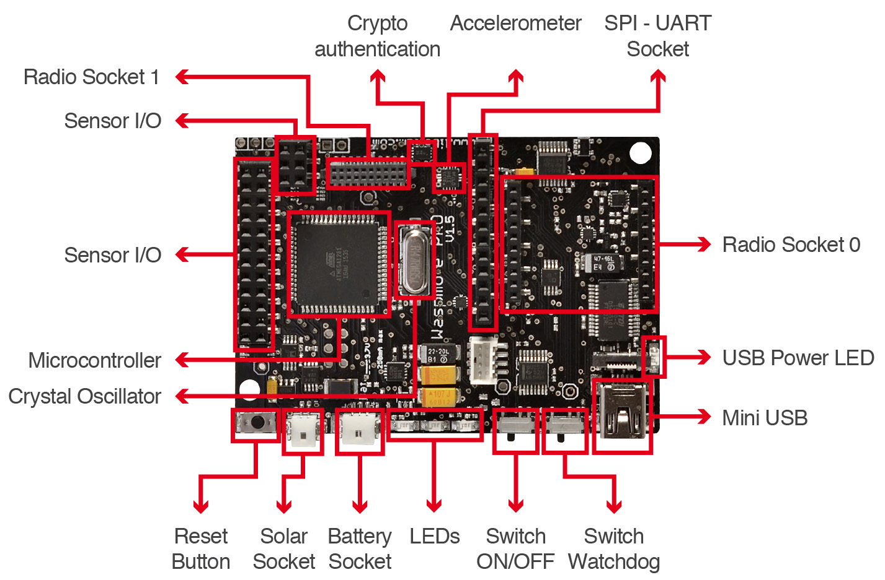
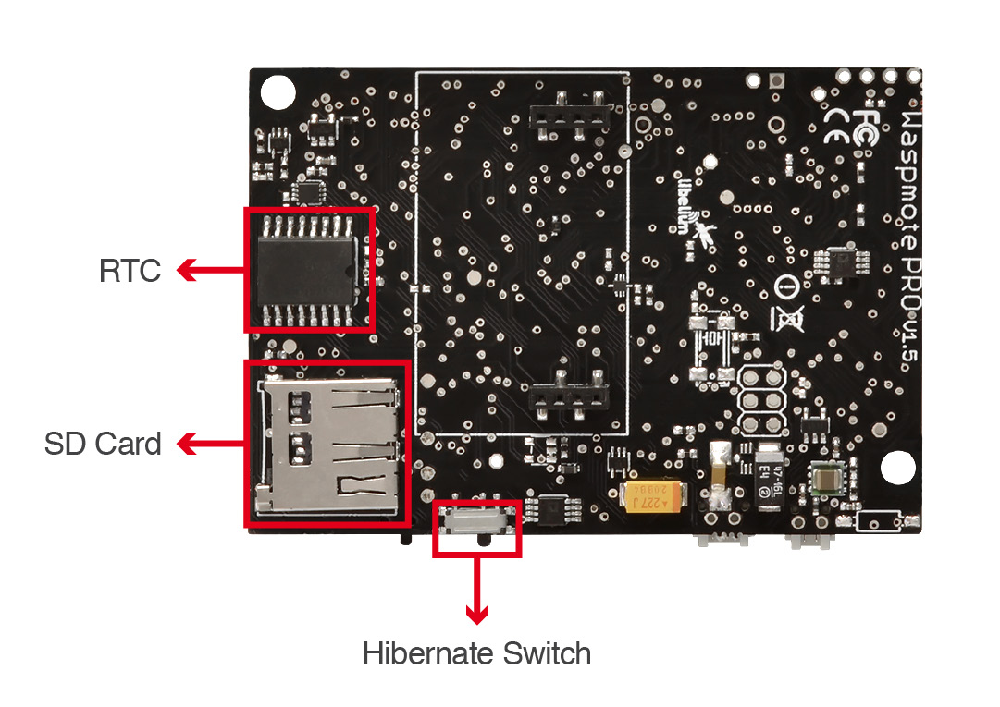
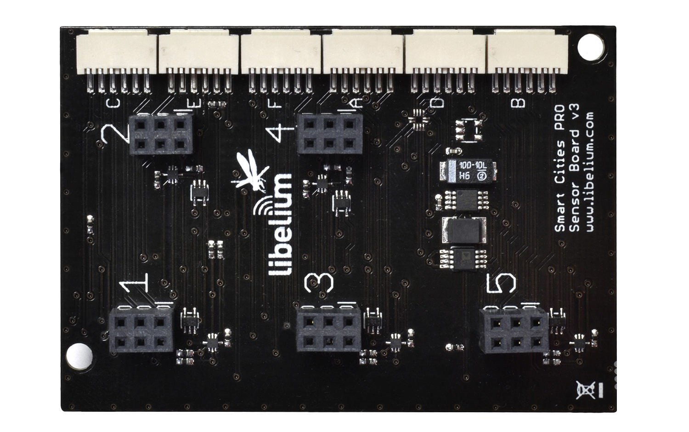
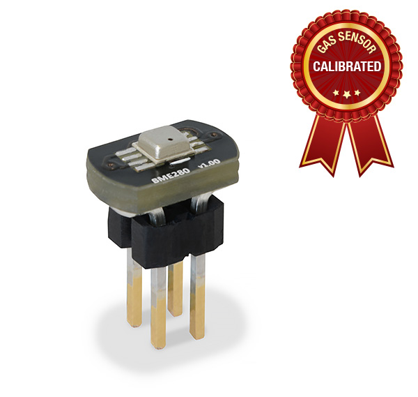
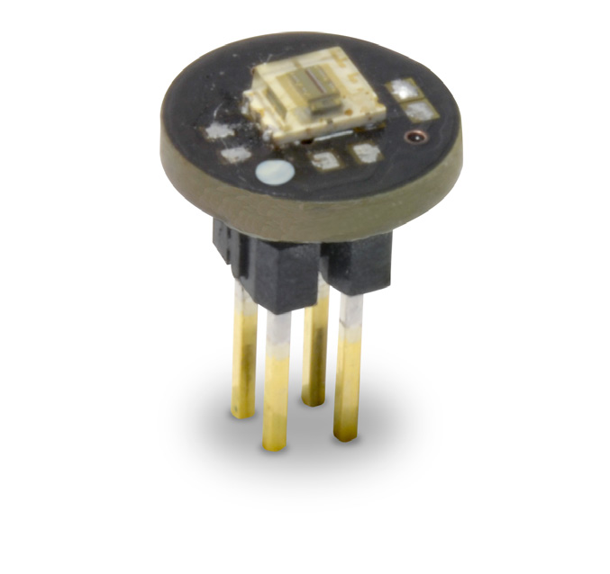
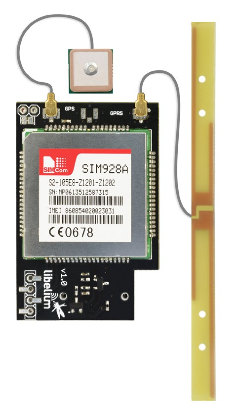
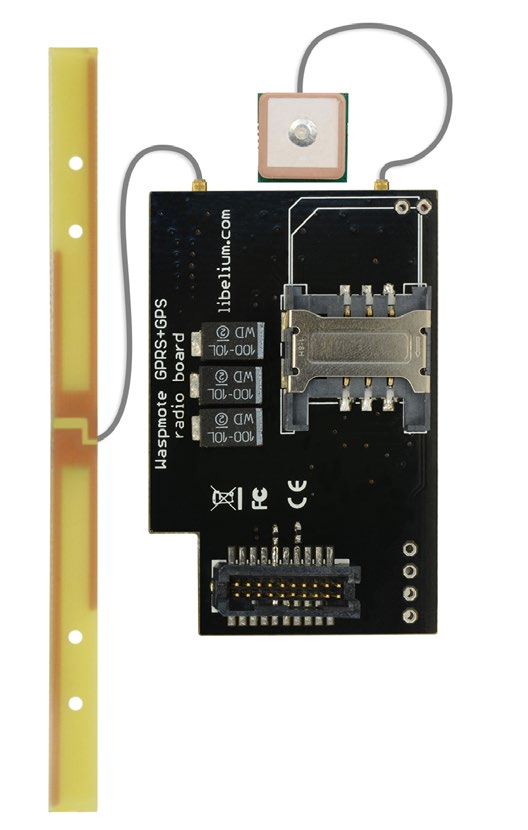
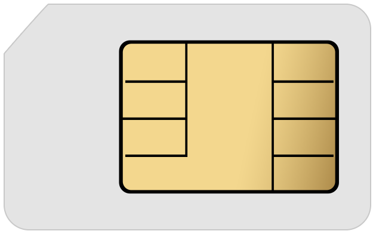

### Proyecto4:octocat:

**Instalaciones Industriales Avanzadas - Bloque II**

**Máster en Ingeniería Industrial - Universidad de Almería**

---

**Autors**:

* Antonio Francisco Giménez Segura @ags186
* Francisco Javier Gonzálvez Craviotto @fjgonzalvez
* Hiscio Francisco Montoya García @hmg422
* Miguel Ramón Urrutia @miguelru

**Lecturer**:

* Gloria Ortega Segura @gloriaortega

---

# PART 1

When ultrasound sensor detects a person passing through, a green LED will be turned on.
Temperature will be taken into account as well. When an 'high' temperature has been 
reached, a red LED will be turned on, turning out the green LED if it was turned on.
On the other hand, luminosity meassurement will be screened every 20 seconds, showing a 
message indicating if it's day or night.

In addition, any time, whereas the button is pressed, the green led will turn on for 10 seconds.

---

**BOM (Bill of Materials)**:

Material | Imagen
------------ | :-------------:
Waspmote board |  
Smart Cities PRO Board | 
Temperature, humidity and pressure sensor BME280 | 
Luminosity sensor | 
Ultrasound sensor I2CXL-MaxSonar®-MB1202™ | 
Protoboard | 
miniUSB to USB cable | 
Button | 
Jumpers | 

# PART 2

**BOM (Bill of Materials)**:

Material | Imagen
------------ | :-------------:
GPS+GPRS module with GPS and GPRS antennas |  
Battery | 
Standard size SIM card with mobile data balance | 
